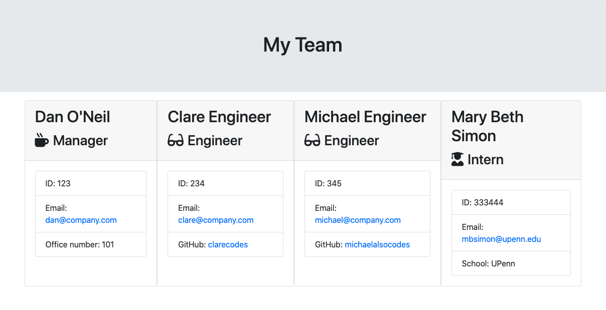

# Team Profile Generator   
Command line application that generates an HTML page with team profiles for a software engineering team. The application uses Inquirer to prompt the user, and builds HTML from existing templates, adding employee info from the user and creating new HTML elements for each team member.

## Table of Contents
- [Installation Steps](#installation-steps)
- [Usage Instructions](#usage-instructions)
- [Licenses](#licenses)
- [Contribution Guidelines](#contribution-guidelines)
- [Testing Instructions](#testing-instructions)

---
## Installation 
Node.js and npm must be installed, as well as the Inquirer package. The application uses the fs module and chalk package as well.

## Usage Instructions
To start this command line application, navigate to the team-profile-generator directory in the terminal, and run the command 'node app.js'.

## Screen Recording

## Sample HTML Output

## Licenses
### GNU GPL vs License

Copyright 2020 Dan O'Neil (dandandanoneil)

This program is free software: you can redistribute it and/or modify it under the terms of the GNU General Public License as published by the Free Software Foundation, either version 3 of the License, or (at your option) any later version.

This program is distributed in the hope that it will be useful, but WITHOUT ANY WARRANTY; without even the implied warranty of MERCHANTABILITY or FITNESS FOR A PARTICULAR PURPOSE.  See the GNU General Public License for more details.

Read more at <https://www.gnu.org/licenses/>.

---
Generated using [README Generator](https://github.com/dandandanoneil/readme-generator)